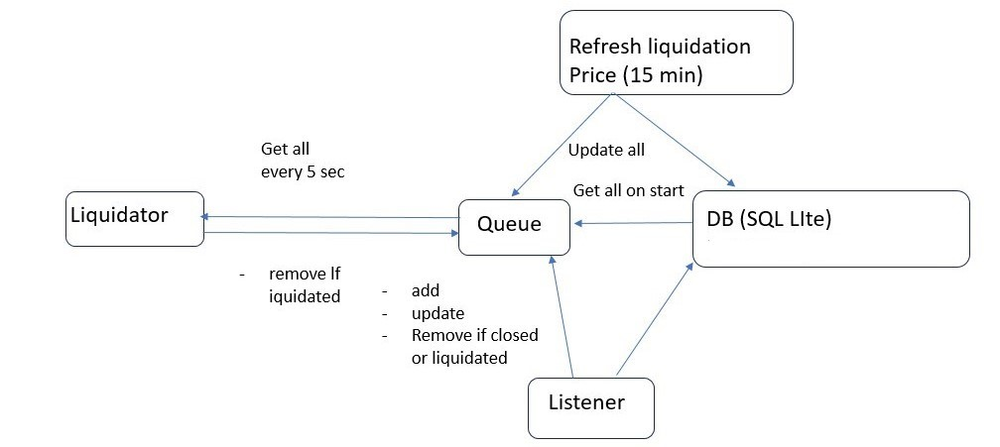

# Flatcoin liquidation keeper

## Overview



## Configuration


| Variable                             | Required | Description                                                                                                                                               | Example                                                                                             |
|--------------------------------------|----------|-----------------------------------------------------------------------------------------------------------------------------------------------------------|-----------------------------------------------------------------------------------------------------|
| PORT                                 | Yes      | Port to deploy application                                                                                                                                | 3000                                                                                                |
| DB_NAME                              | Yes      | Local path to SQLite storage                                                                                                                              | ../../positions.db                                                                                  |
| BLOCKCHAIN_NETWORK_NAME              | Yes      | Network name                                                                                                                                              | Base Goerli                                                                                         |
| CHAIN_ID                             | Yes      | Chain id                                                                                                                                                  | 84351                                                                                               |
| PROVIDER_HTTPS_URL                   | Yes      | Provider URL                                                                                                                                              | https://goerli.base.org                                                                             |
| PYTH_NETWORK_PRICE_URI               | Yes      | Off-chain HTTP API endpoint used to fetch Pyth oracle prices                                                                                              | See https://docs.pyth.network/documentation                                                         |
| PYTH_NETWORK_ETH_USD_PRICE_ID        | Yes      | ETH/USD price feed ID                                                                                                                                     | See https://pyth.network/developers/price-feed-ids                                                  |
| LIQUIDATION_MODULE_CONTRACT_ADDRESS  | Yes      | LiquidationModule contract address                                                                                                                        | See https://github.com/dhedge/flatcoin-v1/blob/testnet-system/deployments/testnet/testnet.base.json |
| LEVERAGE_MODULE_CONTRACT_ADDRESS     | Yes      | LeverageModule contract address                                                                                                                           | See https://github.com/dhedge/flatcoin-v1/blob/testnet-system/deployments/testnet/testnet.base.json |
| VIEWER_CONTRACT_ADDRESS              | Yes      | Viewer contract address                                                                                                                                   | See https://github.com/dhedge/flatcoin-v1/blob/testnet-system/deployments/testnet/testnet.base.json |
| SIGNER_WALLET_PK                     | Yes      | Signer wallet private key                                                                                                                                 |                                                                                                     |
| MAX_BATCH_SIZE_FOR_LIQUIDATION_QUEUE | Yes      | Batch size of positions to be liquidated via RPC batch request                                                                                            | 5                                                                                                   |
| MAX_BATCH_SIZE_FOR_RPC_BATCH_REQUEST | Yes      | Batch size of positions to call via other RPC batch requests                                                                                              | 5                                                                                                   |
| BATCH_WAIT_TIME                      | Yes      | Wait time between batches, ms                                                                                                                             | 500                                                                                                 |
| ETH_PRICE_UPDATE_INTERVAL            | Yes      | Interval to update current ETH price, sec                                                                                                                 | 4                                                                                                   |
| LIQUIDATION_BUFFER_RATIO             | Yes      | Buffer ratio between current ETH price and position with top liquidation price<br/>If lower, all positions are checked for the possibility of liquidation | 0.01                                                                                                |


## Installation

```bash
$ yarn install
```

## Running the app

```bash
# development
$ yarn run start

# watch mode
$ yarn run start:dev

# production mode
$ yarn run start:prod
```

## Test

```bash
# e2e tests
$ yarn run test:e2e

```


